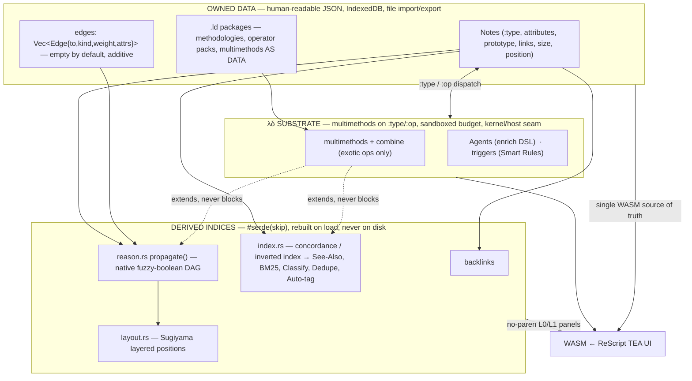

<!-- SPDX-License-Identifier: CC-BY-SA-4.0 -->
# The Management of Mind — Nexia-List's Definitive Plan

*A note is a letter we send to our future self.*

Status: canonical design synthesis · Supersedes the standalone product-vision, UI/UX-overhaul, and FL×DT-integration notes by unifying them. The FL×DT integration decisions are **settled** and enter here as the "intelligence + reasoning" track, not as open questions.

---

## 1. TL;DR + Product Thesis

**Nexia-List is an instrument for the real management of mind** — capturing, structuring, linking, **reasoning over**, recalling, and **resurfacing** decades of thought — that runs entirely on your device, shows nothing you didn't ask for, and works the same on every platform. It is not a place to *store* notes. It is a place where your notes **keep working on your behalf** for as long as you have a mind to manage.

Three commitments define it:

- **Management of mind is the goal.** Every feature is judged by one question: *does this help the letter reach a richer future self?* The category is crowded with capture-and-store tools that abandon the reader at exactly the point where a mind is actually managed — **reason** and **resurface**. That neglected second half of the loop is the product.
- **λδ (LambdaDelta) is the killer underpinning — the enabler, never the goal.** The notebook is live homoiconic Lisp data; behavior is multimethods dispatched on `:type`/`:op`; extensions are `.ld` **packages** that are data, not code-you-must-trust. λδ is why the tool is moldable, lifelong, and user-owned — why it can be reshaped into a form its author never imagined and still be running in twenty years. It is a **door, and the door is closed by default.** Most people should use Nexia for life and never see a parenthesis.
- **Local-first, invisible-by-default, cross-platform.** The Rust core compiles to a single WASM bundle that *is* the engine, running client-side. No server, no account, no cloud, no sync, no lock-in — nothing leaves the device. Progressive disclosure L0→L4 keeps the surface quiet: L0 is a complete, dignified tool usable for a lifetime with zero code. One engine appears everywhere — web-first PWA as the primary product, an optional thin webview shell (desktop *and* mobile) hosting the identical bundle.

The unclaimed intersection Nexia occupies: **local-first + homoiconic + native reasoning + on-device intelligence, with no server and no lock-in.** No other tool holds all four. That intersection is the product; everything else is execution.

---

## 2. The Mind-Management Loop

Note apps optimize *capture-and-store*. Nexia optimizes the actual cycle a thinking person runs over a lifetime:

```
        CAPTURE ──► STRUCTURE ──► LINK ──► REASON ──► RECALL ──► RESURFACE ──► PUBLISH
           ▲                                                                       │
           └──────────────────────────  the future self  ────────────────────────┘
```

The letter is written (**capture**), given shape (**structure**), connected to prior letters (**link**), **argued with** (**reason**), retrieved when needed (**recall**), pushed back to you unbidden at the moment it matters (**resurface**), and — when it must leave the head to reach others — handed out in a portable form (**publish**). Then the future self, now informed, writes the next letter. The loop closes on a person, not a database.

Today's tools are lopsided: excellent at capture, competent at link, and effectively **abandoning the reader** at reason and resurface. Nexia's thesis is that the second half of the loop is where a mind is managed, and it is exactly the half everyone leaves broken.

| Stage | What the user does | The capability that serves it | Level |
|---|---|---|---|
| **Capture** | Get the thought down instantly, no ceremony | Quick-capture into an Inbox (`{:inbox true}`, no canvas dump); `[[ ]]` autocomplete; plain textarea source of truth | L0 |
| **Structure** | Give shape — titles, tags, attributes, prototypes, spatial arrangement | Inspector (attributes/tags/prototype/confidence); canvas; outline; markdown render | L0/L1 |
| **Link** | Connect to prior letters | `[[wikilinks]]` (untyped association) + backlinks — the pattern the whole spine generalizes | L0 |
| **Reason** | Ask *"why do I believe this?"* and see the argument | Typed, weighted `edges` channel + `reason.rs` fuzzy-boolean `propagate()` + `layout.rs` Sugiyama → **ReasoningView** | L2 |
| **Recall** | Retrieve deliberately | BM25 ranked search; palette go-to; enrich-DSL Agents (`similar:`/`near:`/`conf:`/`type:`/`edge:`) | L0/L2 |
| **Resurface** | Be found by the letter you forgot | `index.rs` See-Also (TF-IDF cosine kNN); Duplicates (blake3+SimHash); kNN auto-tag — ambient, volunteered | L1 |
| **Publish** | Hand the letter out portably | Markdown / OPML export (already shipped); JSON import/export; `.ld` packages as shareable data | L0 |

Two crown jewels — **an established build track, not open questions** — complete the broken half:

- **DT-style local recall** closes **recall + resurface.** One on-device intelligence engine (`core/src/index.rs`) builds a concordance and inverted index in memory, `#[serde(skip)]`, rebuilt on load, never trusted from disk. From it: See-Also, BM25, Rocchio/naive-Bayes Classify, blake3+SimHash dedupe, kNN auto-tag. The archive stops being a graveyard you must excavate and becomes a correspondent that writes back.
- **FL-style reasoning** closes **reason.** A separate additive `edges` channel carries typed, weighted relationships; `core/src/reason.rs` runs a pure single-pass DAG `propagate()` with a native fuzzy-boolean operator table (0.5 = Indeterminate). Junctors and entities are ordinary notes tagged `{:type :junct :op and|or|not}`. This is what lets your notebook *argue with you*.

Both jewels collapse onto **one pattern nexia already proved** with `Notebook::backlinks`: a **derived, rebuildable index beside the notes, never trusted from disk**, semantics dispatched on `:type`/`:op` via λδ multimethods, surfaced as no-parenthesis L0/L1 panels. The note model is untouched. Recall and reasoning are not new formats you can be locked into — they are *computed views* over letters you already own. Delete the index; it rebuilds. That is the difference between a feature and a liability.

**How λδ completes the loop without owning it:** the native engines are the **floor, not the ceiling.** See-Also, BM25, classify, propagate all run in Rust at native speed, no Lisp required. λδ enters only at the seams — the `combine` multimethod for exotic/domain reasoning operators, Agents as saved composable queries, and `.ld` packages carrying whole methodologies as data. The loop runs at full speed for the L0 user and is infinitely re-shapable for the one who opens a door.

---

## 3. Positioning

The center of this Venn diagram is empty. Each incumbent is world-class at one move and structurally incapable of another.

| Tool | Crown jewel | Structural ceiling | What Nexia does differently |
|---|---|---|---|
| **Tinderbox** | Spatial thinking, agents, prototypes, attribute-driven emergence | macOS-only, closed, single-vendor mortality; a formula language bolted on at the edge | The North Star + agent/prototype spirit — but **cross-platform, open, homoiconic to the core** |
| **Obsidian** | Local Markdown files, plugin ecosystem, backlinks | Plugins bolt onto a passive editor; no native reasoning or intelligence; the graph is decorative | **Reasoning and recall are native**, not a plugin lottery; the graph *computes* (See-Also, propagate) |
| **Roam / Logseq** | Outliner + bidirectional block links; daily-notes capture | The graph is *associative only* — it links but never **argues**; recall is manual; hosted/lock-in pressure | Typed, weighted **inference** on top of association; ambient recall; JSON you can walk away with |
| **Tana** | Supertags, structured queries, AI-native | **Cloud-required, account-required, subscription** — the archive is a tenant of a company | Same structure/query power, **on your device, no account, runs after the company is gone** |
| **DEVONthink** | The best local recall in the business (See-Also / classify) | macOS-only, closed; document-manager, not a thinking surface; no reasoning layer | **Its exact algorithms in portable Rust/WASM**, married to a thinking canvas + a reasoning engine it never had |
| **Flying Logic** | Rigorous fuzzy-logic reasoning over typed graphs | A standalone diagrammer disconnected from your *notes* — reason in one silo, think in another | **Reasoning happens over your actual notebook** — junctors are notes, evidence is notes, one corpus |

Tinderbox has the philosophy but not the platforms; Obsidian the files but not the mind; Tana the structure but not the ownership; DEVONthink the recall but not the thinking; Flying Logic the reasoning but not the notes. **Nexia is the only tool that puts DEVONthink's recall and Flying Logic's reasoning *inside* a Tinderbox-spirited, Obsidian-portable, no-cloud notebook — and makes the whole thing homoiconic so it can never ossify.**

---

## 4. Architecture Principle — the λδ-centric spine

**Everything expressible through λδ + a typed graph + attributes + derived indices.** The note model is the primary, human-readable, user-owned data. Everything intelligent is a **derived index computed beside it** and never trusted from disk. Behavior is **λδ multimethods on `:type`/`:op`**. Native Rust hot paths exist where perf demands (the floor); λδ extension is available everywhere (no ceiling); `.ld` packages are the moldability surface where methodologies live as data.

Five rules keep it honest:

1. **Derived, never trusted; rebuildable, never load-bearing.** Backlinks, See-Also, BM25, reasoning layout — all `#[serde(skip)]`, rebuilt on load. Corrupt the index, lose nothing. The letters are primary; the intelligence is a lens you can drop and re-grind.
2. **The note model is untouched by advanced features.** The single new field is `edges: Vec<Edge>` — empty by default, `skip_serializing_if` empty, byte-identical round-trip. `links` stays untyped association. `position` stays user-authored; `layout.rs`/`reason.rs` positions are derived and **never written back** to `Note.position`.
3. **Native is a floor, not a ceiling.** Common operations run in fast Rust; λδ `combine` multimethods handle only the exotic and domain-specific. Users never pay a Lisp tax for the 95% case and never hit a wall in the 5%.
4. **Methodologies are data, not engine.** FL operator packs, DT methodologies, the six TOC thinking-process trees ship as `.ld` **packages**. The native surface stays tiny: `index.rs`, `edge.rs`, `reason.rs`, `trigger.rs`, later `layout.rs` — one struct, one note field.
5. **Invisible by default.** Parentheses never appear until a user opens a power door. Derived panels mount only when their set is non-empty.



Native new surface is small: `index.rs`, `edge.rs`, `reason.rs`, `trigger.rs`, later `layout.rs`, plus a `render_markdown` export. Everything users recognize as "intelligence" is λδ multimethods + `.ld` packages + Agents on top.

---

## 5. Three Interlocking Tracks

The plan advances on three tracks that share the same spine. They interlock: **A** provides the moldability surface everything extends through, **B** is the settled FL×DT intelligence engine, **C** is the surface that makes both usable without a parenthesis.

### Track A — λδ Substrate & Moldability

**What ships:** the homoiconic base stays the enabler everything is open to — multimethods on `:type`/`:op`, sandboxed budget, kernel/host seam, `.ld` package loader, and the `combine` multimethod as the single extension point for exotic reasoning operators. Domains (FL class+operator packs, DT methodologies, the six TOC trees) ship as `.ld` **data packages**, never core enums.

**Deltas:**
- **Rust:** `.ld` package loader + signing verification (L4); `combine` multimethod registration hook in `reason.rs` invoked **only outside the propagation hot loop** (see §8 do-not-build). Host builtins already present.
- **λδ:** methodology packages authored as data; multimethod definitions for domain `:op`s; Agent definitions in the enrich DSL.
- **ReScript:** `Editor.LambdaCell` renders fenced ```` ```λδ ```` blocks — **source collapsed, result inline** — through the already-exported (currently unbound) `evalLambdadelta` (budgeted/sandboxed), memoized by source hash. `powerLevel >= 3` gates authoring.

### Track B — Local Intelligence + Typed Reasoning (the settled FL×DT integration)

**What ships (summarized; not relitigated):**
- **DEVONthink crown jewel = one local intelligence engine,** `core/src/index.rs`: `#[serde(skip)]`, rebuilt on load, DENSE `DocId` interning (~35–50 MB @ 10k notes). Concordance/inverted index → **See-Also** (TF-IDF cosine kNN), **BM25** ranked search, **Rocchio Classify** (+ naive-Bayes pack), **blake3+SimHash** duplicate detection, **kNN auto-tag**. Smart Groups == existing **Agents** (enrich DSL `similar:`/`near:`/`conf:`/`type:`/`edge:`). Smart Rules == **`Notebook.triggers`** (event→predicate→λδ Action). Replicants are free (one `Uuid`).
- **Flying Logic crown jewel = a separate additive `edges: Vec<Edge{to,kind,weight,attrs}>` channel** on `Note` (empty by default, byte-identical round-trip; `links` stays untyped). Junctors/entities/groups are ordinary notes tagged `{:type :junct :op …}`. `core/src/reason.rs` = pure single-pass DAG `propagate()` (DFS back-edge exclusion + Kahn topo + **native fuzzy-boolean operator table**; 0.5 = Indeterminate; edge-weight transforms for support/abstain/negate). `core/src/layout.rs` = Sugiyama layered layout → a **ReasoningView** replacing the GraphView placeholder; positions **derived, never stored** on `Note.position`. λδ `combine` multimethod only for exotic/domain ops.

**Data-model deltas:** exactly **one struct** (`Edge`) and **one `Note` field** (`edges`). No promotion of `links → Vec<Link>`. No persisted derived indices. New native files: `index.rs`, `edge.rs`, `reason.rs`, `trigger.rs`, later `layout.rs`.

**FIRST PR (settled):** headless `index.rs` + tokenizer + incremental reindex hooks (on `set_content` **and both title write paths**) + `rebuild_indices`; property-tested against golden fixtures; **zero UI, zero on-disk change.**

**Deltas:**
- **Rust:** the five files above; `wasm.rs` exports `see_also`, `duplicates`, `classify`, `add_edge`, `remove_edge`, `reason`, `render_markdown`.
- **ReScript:** `WasmStore` binds them; `Update.refreshContext` derives See-Also/Duplicates/tag-suggest on selection change (only when the selected id actually changes, never per keystroke); `refreshReasoning` runs on entering `PReasoning` and on edge/confidence edits, debounced like autosave.

### Track C — UI/UX Overhaul & Cross-Platform

**What ships:** the hand-rolled TEA grows from a single-pane textarea+canvas into a multi-pane workspace with a real editor, command palette, inspector, context panels, the ReasoningView, outline/timeline/browser, quick-capture/inbox, theming, and an installable PWA — all gated by the two disclosure mechanisms in §6, never an ad-hoc `if`.

**Deltas:** the full `Types`/`Model`/`Msg`/`Update`/`View` map is §6–7. Cross-platform: the WASM bundle is the single source of truth; web-first PWA is primary (manifest + already-registered service worker + IndexedDB/OPFS); the optional Gossamer webview shell (external sibling checkout, outside this repo's CI) hosts the identical bundle for desktop **and** mobile with zero port and no type drift; Pointer Events unify mouse/pen/touch; file-over-app JSON/Markdown/OPML is the only sync boundary that will ever exist.

---

## 6. UI/UX Overhaul Specifics

### The disclosure ladder — two gates, never an ad-hoc `if`

| L | Name | What appears | Gate |
|---|---|---|---|
| **L0** | The Letter | plain notes, `[[wikilinks]]`, search, list, sidebar, canvas, quick-capture. Usable for life, zero parens. | always on |
| **L1** | Living notes | See-Also / Duplicates / Backlinks panels; Inspector (attrs/tags/prototype/confidence); inline λδ **results** (never source); rendered markdown | **data-gated:** mounts iff its derived set is non-empty |
| **L2** | Composer | command palette, typed edges + drag-to-link, ReasoningView, Agents in enrich DSL, outline/timeline/browser | **door-gated:** `powerLevel >= 2` |
| **L3** | Programmer | λδ code cells, `.ld` packages, Smart Rules (`Notebook.triggers`), multimethod authoring | `powerLevel >= 3` |
| **L4** | Kernel/host | kernel seam, budget tuning, host builtin registration, package signing | `powerLevel >= 4` |

```rescript
// Model.res — one scalar governs door-gating; persisted like theme.
powerLevel: int,   // 0..4, default 0. A door, never a wall.

// View.res — the two gates as reusable combinators.
let whenPower = (model, level, node) => model.powerLevel >= level ? node : React.null
let whenNonEmpty = (xs, render) => Array.length(xs) == 0 ? React.null : render(xs)
```
> **Reviewer rule (tested):** an L1 panel rendering an empty header is a bug; an L2 button visible at `powerLevel == 0` is a bug.

### Consolidated TEA deltas (the spine everything hangs on)

`Types.res` — all additive; `note` gains exactly **one** field (`edges`, matching the decided FL×DT channel):

```rescript
type edgeKind = Supports | Opposes | Requires | Causes | Contradicts | Custom(string)
type edge = { to_: noteId, kind: edgeKind, weight: float, attrs: Js.Dict.t<Js.Json.t> }
// note gains: edges: array<edge>,   (links stays untyped association)
type confidence = float                        // 0.0..1.0 ; 0.5 = Indeterminate
type suggestion = { id: noteId, score: float }  // See-Also / duplicates / classify rows
type mdNode =                                    // produced by Rust core (pulldown-cmark → typed AST)
  | MdText(string) | MdStrong(array<mdNode>) | MdEmph(array<mdNode>) | MdCode(string)
  | MdLink(string, array<mdNode>) | MdWikiLink(noteId, string) | MdWikiDangling(string)
  | MdHeading(int, array<mdNode>) | MdPara(array<mdNode>) | MdList(bool, array<array<mdNode>>)
  | MdTask(bool, array<mdNode>) | MdQuote(array<mdNode>) | MdCodeBlock(string, string) // lang="λδ" ⇒ cell
type facet = FacetAll | FacetTag(string) | FacetAttr(string, string)
type paneContent = PList | PCanvas | PReasoning | POutline | PTimeline | PBrowser(facet) | PInbox
type pane = { id: string, content: paneContent, flex: float }
type peek = { anchor: noteId, target: noteId, x: float, y: float }
type paletteMode = PCommand | PGoto | PSlash | PLink
type editorMode = ESource | ERendered | ESplit
type theme = TSystem | TLight | TDark
type canvasTool = TSelect | TEdge(edgeKind)
type reasonNode = { id: noteId, x: float, y: float, layer: int, derived: confidence, isDriver: bool, isDriven: bool }
type reasonEdge = { from: noteId, to_: noteId, kind: edgeKind, weight: float, back: bool }
type reasonResult = { nodes: array<reasonNode>, edges: array<reasonEdge> }
```

`Model.res` additions (grouped): `panes / focusedPane / inspectorOpen / peek`; `palette / autocomplete`; `editorMode`; `contextFor / seeAlso / duplicates / tagSuggest`; `reasoning`; `outlineExpanded / timelineField / canvasTool / marquee / edgeDraft`; `theme / installPrompt / narrow / powerLevel`.

`Msg.res` additions (named, grouped): editor (`SetEditorMode`, `OpenAutocomplete`, `AcceptAutocomplete`, `InsertAtCaret`, `RunLambdaCell`, `LambdaCellResult`); palette (`OpenPalette`/`UpdatePalette`/`MovePalette`/`RunPaletteItem`/`ClosePalette`); panes/inspector/peek (`SplitPane`/`FocusPane`/`SetPaneContent`/`ToggleInspector`/`OpenPeek`/`ClosePeek`/`SetAttribute`/`SetPrototype`/`SetConfidence`/`AddTag`/`RemoveTag`); context (`RefreshContext`/`MergeDuplicate`/`AcceptTagSuggestion`); reasoning (`RefreshReasoning`/`AddEdge`/`RemoveEdge`/`SetEdgeWeight`); views (`ToggleOutlineNode`/`SetTimelineField`/`SetCanvasTool`/`StartMarquee`…/`StartEdgeDraw`…/`RecenterCanvas`); inbox (`QuickCapture`/`FileFromInbox`); env (`SetTheme`/`CapturedInstallPrompt`/`PromptInstall`/`SetNarrow`/`SetPowerLevel`).

The **one `Update.res` change** everything plugs into — extend the existing "re-run active agent after each step" wrapper to also refresh derived context on selection change (cheap: fires only when the selected id changes; the DT index is incrementally maintained core-side):

```rescript
let rec update = (model, msg) => model->step(msg)->refreshAgent->refreshContext(model)
and refreshContext = (prev, next) => {
  let sel = m => switch m.selection { | SingleNote(id) => Some(id) | _ => None }
  switch sel(next) {
  | Some(id) when sel(prev) != Some(id) =>
    { ...next, contextFor: Some(id),
      seeAlso: WasmStore.seeAlso(id), duplicates: WasmStore.duplicates(id), tagSuggest: WasmStore.classify(id) }
  | _ => next } }
```
`refreshReasoning` is deliberately **not** in the hot path — it runs on entering `PReasoning` and on `AddEdge`/`RemoveEdge`/`SetConfidence`, debounced like `Persist.scheduleAutosave`. The existing `SetViewMode(mode)` becomes sugar over `SetPaneContent(model.focusedPane, …)` so the current Toolbar keeps working verbatim.

`WasmStore.res` seam additions (each maps to a `wasm.rs` method): the complete existing surface—including `set_attribute`, `run_query`, `backlinks`, and all λδ entry points—is now bound; add the new FL×DT exports `render_markdown`, `see_also`, `duplicates`, `classify`, `add_edge`, `remove_edge`, `reason`, `set_prototype`. All of `reason`/`see_also`/`duplicates`/`classify` are `#[serde(skip)]`-backed and rebuilt on load; `reasonResult` positions come from `layout.rs`, never `Note.position`.

### Surface-by-surface

- **Editor** (`Editor.res`, replaces the `NoteEditor` textarea). Controlled `<textarea>` stays the source of truth (L0 plain text untouched, note on disk still just text). Per-pane `ESource ⇄ ERendered ⇄ ESplit`. Rendered maps `mdNode → React`; `MdWikiLink` is a live link (click → select, hover → `OpenPeek`), `MdWikiDangling` a create affordance. `[[` autocomplete anchors a caret popup listing `run_query` hits → `InsertAtCaret` splices `[[Title]]` and reuses `applyDelta` so backlinks reindex for free. `/` slash menu (`/todo`, `/table`, `/date`; L3 `/λδ`, `/rule`). Fenced ```` ```λδ ```` renders as `Editor.LambdaCell` — result inline, source collapsed. **A user who never opens a λδ fence never sees a parenthesis.** *(L0 source / L1 render / L3 cells)*
- **Command palette** (`Palette.res`). `Cmd/Ctrl-K` → `PCommand`; `Cmd/Ctrl-O` → `PGoto` fuzzy go-to (BM25 via `run_query`); `>` commands, `[[` link-insert. Registry filtered by `powerLevel` (an L0 user sees only capture/search/new). Focus-trapped `role="dialog"`, `aria-activedescendant` tracks `cursor`. Every command shows its shortcut hint, so the palette *teaches* the keyboard flow and is the single discovery surface for all L2+ power. *(L2; `PGoto`/capture rows L0-safe)*
- **Inspector** (`Inspector.res`, right-hand, default closed). Editable attribute rows (`SetAttribute`), tag chips with `tagSuggest` ghosts, prototype picker (`SetPrototype`), confidence spinner (`ConfidenceSpinner`, `role="slider"`). Surfaces the note's own existing data (`note.attributes`/`note.prototype` already exist) no-code. *(L1, mounts only when a note is focused)*
- **Context / See-Also panels** (`Context.res`). For the focused note: **See-Also** (`see_also`, TF-IDF kNN, relevance bar), **Backlinks** (moved out of the editor), **Duplicates** (`duplicates`, blake3+SimHash, with **Merge** → `MergeDuplicate`). Each `whenNonEmpty`-mounts, so nothing ever nags. The DT crown jewel as flat, no-paren lists. *(L1, data-gated; zero on-disk change)*
- **Reasoning view** (`ReasoningView.res`, replaces the `GraphView` placeholder; `GraphLayout.circular` retires). Layered DAG from `reason()` (`propagate()` + Sugiyama). ClaimCards (title + live derived `ConfidenceSpinner`), compact JunctCards for `{:type :junct}`. Typed edges colored by `edgeKind`; **back-edges dashed** (excluded from propagation); **driver** nodes warm, **driven** cool. Drag port→port draws a typed edge (`AddEdge`, kind from `canvasTool`); editing a driver's seed confidence re-runs propagation and downstream spinners animate (respect `prefers-reduced-motion` — snap, don't tween). **No per-node λδ dispatch in the propagation loop.** *(L2)*
- **Outline / Timeline / Attribute-browser.** `OutlineView` (tree over `[[ ]]`, reuses OPML tree logic, `ToggleOutlineNode`); `TimelineView` (bucket by `createdAt`/`modifiedAt` — already ISO strings, zero new data; `{:due …}` plots too); `BrowserView` (faceted browse via `run_query("tag:… attr:…")`, "Save as Agent" turns a facet into an Agent). *(L2)*
- **Upgraded canvas.** Keeps L0 drag/pan/wheel-zoom/dbl-click-create. Adds marquee select, drag-to-link (`TSelect` → untyped `LinkNotes`; `TEdge(kind)` → typed `AddEdge`), minimap (`RecenterCanvas`), adornments (group boxes = notes tagged `{:type :group}`, no schema change). Document listeners migrate `mouse*` → **Pointer Events** so marquee/edge-draw work under touch. *(L0 core, L2 extras)*
- **Quick-capture / Inbox** (`QuickCapture.res` modal + `InboxView`). `Cmd/Ctrl-Shift-N` → one-line field; Enter creates a note tagged `{:inbox true}` with no `position` (never dumped on canvas). `PInbox` lists them; **File** assigns tags/links and clears the flag. Inbox is literally an Agent (`attr:inbox=true`) — no new query engine. *(L0)*
- **Theming** (`Theme.res`). `TSystem|TLight|TDark` via `data-theme` on root + CSS custom properties; `TSystem` follows `prefers-color-scheme`; persisted via `Persist`. *(L0)*
- **PWA / mobile** (`Install.res`). `narrow` breakpoint (`matchMedia("(max-width:720px)")`): Sidebar/Inspector become slide-over drawers (`sidebarOpen`/`inspectorOpen` already exist), panes render as a horizontal snap-scroll strip, hit targets grow. Pinch-zoom reuses `ZoomCanvas`/`PanCanvas` (no new msgs). `beforeinstallprompt` captured → toolbar "Install" affordance → `PromptInstall`. Service worker already registered; add `manifest.webmanifest` (icons, `display: standalone`, theme color synced). *(L0)*

---

## 7. Unified Phased Roadmap

One sequence merges the settled FL×DT PR order with the UI/product work, crosswalked to L0→L4. Every phase is shippable; L0 stays no-code throughout; no derived index is ever persisted; the only new `note` field (`edges`) serializes to nothing when empty.

| Phase | Ships | New core | New UI | L |
|---|---|---|---|---|
| **P0 — Foundations** | Bind the already-exported-but-unbound core methods (`set_attribute`, `run_query`, `backlinks`, `evalLambdadelta`); Inspector, Context/Backlinks, theming, PWA manifest, quick-capture/Inbox | **FIRST PR = headless `index.rs` + tokenizer + incremental reindex hooks (`set_content` + both title write paths) + `rebuild_indices`, property-tested vs golden fixtures, zero UI, zero on-disk change** | `Inspector`, `Context`, `Theme`, `Install`, `QuickCapture`, `InboxView` | L0/L1 |
| **P1 — Recall + real editor** | See-Also / Duplicates / tag-suggest panels; markdown render + `[[ ]]` autocomplete + slash menu | `index.rs` `see_also`/`duplicates`/`classify`; `render_markdown` (pulldown-cmark → WASM) | `Editor.*`, `Context.SeeAlso/Duplicates` | L1 |
| **P2 — Composer** | Command palette; multi-pane / peek / stacked; outline / timeline / browser; upgraded canvas (marquee, minimap, drag-to-link, Pointer Events) | `edge.rs` (`add_edge`/`remove_edge`) | `Palette`, `Workspace`, `Peek`, `OutlineView`, `TimelineView`, `BrowserView`, `Canvas.*` | L2 |
| **P3 — Reasoning** | ReasoningView (typed edges, confidence spinners, driver/driven shading, dashed back-edges); Smart Rules | `reason.rs` `propagate()` + `layout.rs` Sugiyama; `trigger.rs` | `ReasoningView.*`, `ConfidenceSpinner` | L2 |
| **P4 — Programmer/Kernel** | Inline λδ cells; `.ld` packages (FL packs, DT methodologies, the six TOC trees as data); `combine`/multimethod authoring; `powerLevel` 3–4 doors | λδ host builtins (present) + package loader/signing | `Editor.LambdaCell`, package/rule editors | L3/L4 |

**Recommended first few PRs (in order):**
1. **Headless `index.rs`** — tokenizer + inverted index + incremental reindex hooks + `rebuild_indices`, property-tested against golden fixtures. Zero UI, zero on-disk change. *(the settled FIRST PR)*
2. **Bind the dormant `wasm.rs` methods** in `WasmStore` — **done**; follow with the `refreshContext` wrapper change + `powerLevel`/`whenPower`/`whenNonEmpty` scaffolding. No new core.
3. **Inspector + Context/Backlinks + Quick-capture/Inbox + theming + PWA manifest** — all no-code L0/L1 surfaces over data that already exists.
4. **`see_also`/`duplicates`/`classify` exports + Context panels** — the first visible payoff of PR 1's index.
5. **`render_markdown` + `Editor` (render / `[[ ]]` autocomplete / slash)** — the editor leap, still L0-safe in `ESource`.

---

## 8. What We Deliberately Do NOT Build

**Enforced engineering non-goals (carried, unchanged):**
- Promote `Note.links → Vec<Link>` (touches ~6 files; `links` stays untyped association — typing lives in the additive `edges` channel).
- Per-node λδ dispatch inside the propagation loop (Budget drain + `RefCell` reborrow panic). λδ `combine` is invoked only outside the hot loop; the native fuzzy-boolean table is the floor.
- TOC templates as engine features (they are `.ld` **packages** — data).
- A full Dempster–Shafer belief engine.
- Persisting derived indices to disk (backlinks, See-Also, BM25, reasoning layout are all `#[serde(skip)]`, rebuilt on load).
- OCR, RSS, web clipping, email import, cloud sync, mandatory generative AI, PDF/binary handling.
- Mandatory GenAI / AppleScript host.

**Product & UI non-goals (added):**
- **No sync, ever** — explicit non-goal; the file is the sync boundary and it is yours. No real-time collaboration, no accounts, no subscription, no lock-in.
- **Bun only** — no npm/Deno/Yarn/pnpm; markdown is Rust `pulldown-cmark` → typed AST → ReScript-to-React mapping; spinners, minimap, reasoning canvas are hand-rolled SVG.
- **No separate desktop/mobile codebase** — one WASM bundle; the Gossamer shell (external sibling checkout, outside this repo's CI) hosts the identical bundle, reimplementing nothing. Desktop and mobile are distribution choices, not products.
- **No parenthesis before a door** — no L2+ surface visible at `powerLevel == 0`; no L1 panel that renders an empty header.
- **No feature that makes a note harder to write, read, or take with you** — power serves the letter and never fences it in; the note model stays untouched by every advanced feature.
- **Breadth for its own sake** — "do fewer things well." The tool that manages a mind should be small, sharp, and comprehensible.

---

## 9. Risks & Open Questions

- **Memory at scale.** `index.rs` targets ~35–50 MB @ 10k notes with DENSE `DocId` interning. Beyond ~50k notes in a browser tab, WASM memory and rebuild-on-load time need measuring; possible mitigations (all L0-invisible): OPFS-backed segment caching of the index with a validation hash (still never *trusted* from disk), or lazy per-facet index construction. **Open:** what is the real ceiling on a mid-range phone?
- **Rebuild-on-load latency.** Deriving everything on load is the safety property, but a cold open of a large notebook must stay snappy. **Open:** do we need a progressive "index warming" pass (BM25 first, See-Also second) with the UI usable before it completes?
- **`render_markdown` round-trip fidelity.** The textarea stays the source of truth, but `MdWikiLink` resolution and `[[ ]]` create-on-link must never mangle the underlying text. **Open:** confirm byte-preservation for pathological inputs (nested fences, unclosed `[[`).
- **Sugiyama layout stability.** Positions are derived and unstored; re-running `layout.rs` after an edge edit must not jitter unrelated nodes distractingly. **Open:** does the layered layout need incremental/stable ordering, or is snap-with-reduced-motion enough?
- **Enrich-DSL vs. a real query language.** Agents lean on `similar:`/`near:`/`conf:`/`type:`/`edge:`. **Open:** where is the ceiling before users want boolean composition — and does that ceiling get answered by λδ (a door) rather than by growing the DSL?
- **`.ld` package trust.** Packages are data, but multimethod/`combine` definitions are executable behavior under the budget/sandbox. **Open:** signing (L4) is listed, but what is the default posture for an unsigned community pack — refuse, warn, or budget-restrict?
- **Pointer-event migration regressions.** Moving canvas listeners `mouse* → pointer*` touches the most-used L0 surface. **Open:** verification plan for pen/touch/mouse parity, especially marquee vs. pan disambiguation.
- **Confidence semantics legibility.** 0.5 = Indeterminate and edge-weight support/abstain/negate transforms are principled but unfamiliar. **Open:** how much of the fuzzy-boolean model must the ReasoningView *explain* in-situ before it reads as trustworthy rather than magical?

---

*The surface is quiet, the substrate is unbounded, and the boundary between them is a door the user chooses to open. A note is a letter we send to our future self. Nexia-List makes sure it arrives — and that the self who reads it is the better for every letter before it.*
